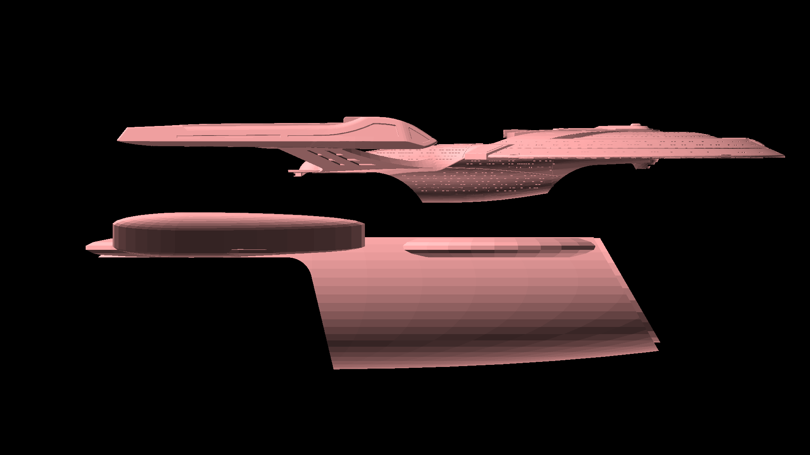
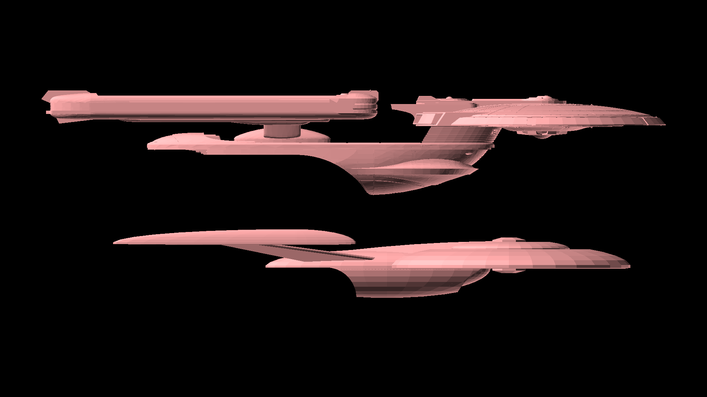
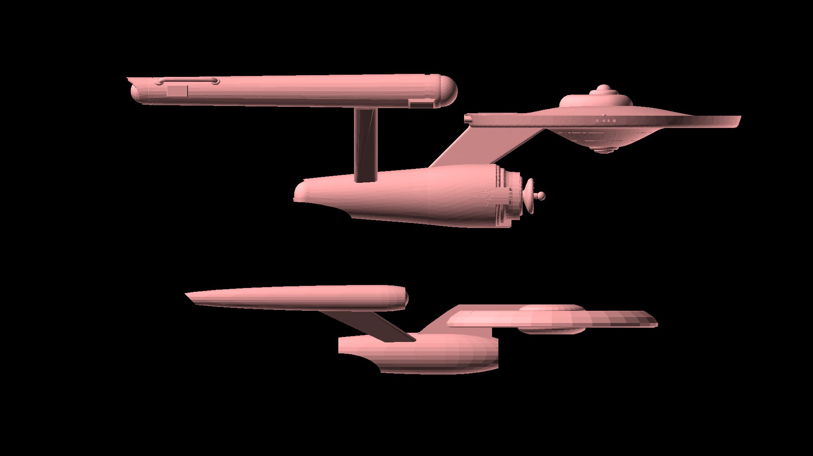
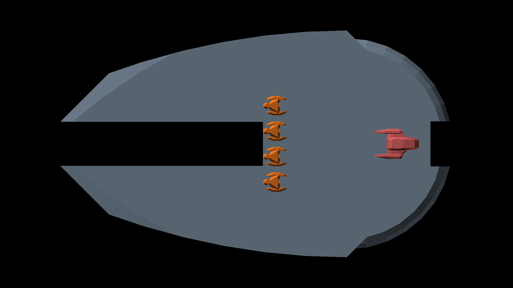
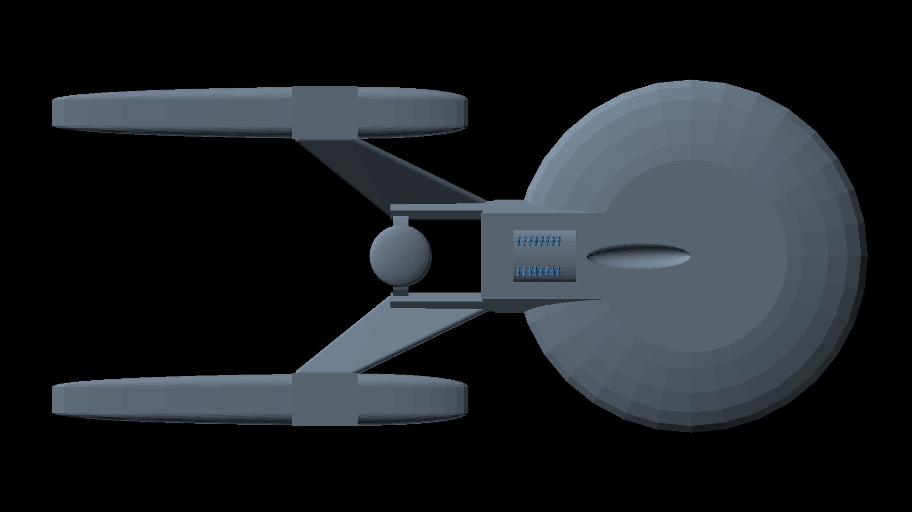
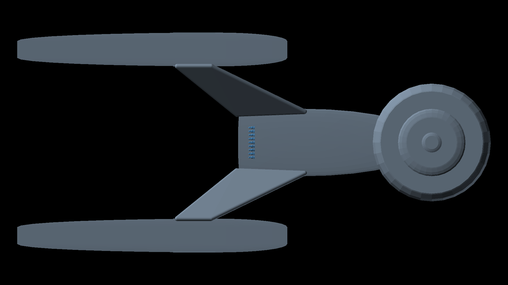
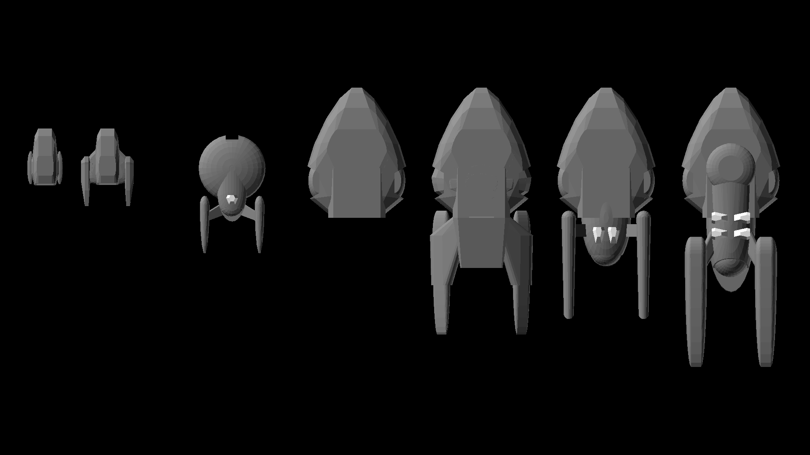

# Starship Designs

Star Trek type starships

## Trinity Class

[View 3d](https://github.com/prasannax1/starships/blob/master/stl/mother/main.stl)

Trinity Class Multi-mission Deep Space Explorer/Heavy Carrier

### Stats

 * Length: 1595m
 * Width: 746m
 * Height: 250m
 * Decks: 58
 * Crew Capacity:
   * Minimum (skeleton): 10
   * Minimum (sustainable): 113
   * Typical: 3000
   * Maximum (all stations filled): 12000
   * Maximum (evacuation limit): 90000
 * Auxillary Craft
   * *Magpie* class runabouts
   * *Hawk* class tactical runabouts
   * *Hornet* class heavy shuttles
   * *Wasp* class shuttles
   * *Black Widow* class fighters
   * *Scorpion* class runabouts
   * *Raven* class heavy runabouts
   * *Vulture* class patrol vessels
   * *Eagle* class light scouts
   * *Dragonfly* class warp tugs
   * *Dove* class diplomatic yachts
   * *Snow Owl* class yachts
   * *Nightingale* class heavy medevac vehicles
   * *Bumblebee* class light shuttles
   * *Honeybee* class light shuttlepods
 * Warp speed:
   * Cruising: Warp 6
   * Maximum: Warp 8
   * Transwarp: TW10

### Description

The *Trinity Class* is meant to act as both a deep space explorer, and as a mobile starbase to launch other exploration missions from. It is designed primarily for scientific missions, but like any ship designed after Wolf 359 and The Dominion War, it can also be used in military conflicts.

The *Trinity Class* is enormous, at about a mile long, it's gigantic compared with even regular large ships.

### Structure

The *Trinity* is an amalgamation of several smaller ships which can operate independently but normally link up to join the Trinity. Multi-vector mode is a nice idea for smaller ships - but for a ship that's about a mile long it's impossible to build without.

#### Vishnu Class

[View 3D](https://github.com/prasannax1/starships/blob/master/stl/mother/saucer.stl)

*Vishnu Class* Mobile starbase/Colony Transporter

##### Stats

 * Length: 746m
 * Width: 746m
 * Height: 100m
 * Decks: 30
 * Crew Capacity:
   * Minimum (skeleton): 5
   * Minimum (sustainable): 50
   * Typical: 2500
   * Maximum (all stations filled): 10000
   * Maximum (evacuation limit): 75000
 * Auxillary Craft
   * *Magpie* class runabouts
   * *Hawk* class tactical runabouts
   * *Vulture* class patrol vessels
   * *Eagle* class light scouts
   * *Dove* class diplomatic yachts
   * *Bumblebee* class light shuttles
   * *Snow Owl* class yachts
 * Warp speed:
   * Cruising: Warp 1.2
   * Maximum: Warp 1.6

   
At 750m long, the Vishnu class is one of the largest ships in the Starfleet inventory. It's built almost entirely primary hull, with the engine sections and warp nacelles integrated into the saucer body. The upper part of the saucer has a depression where the primary hull of the *Laxmi* class fits snugly.

6 decks in the widest part of the saucer form the primary hangar of the *Vishnu* class which runs all the way through from fore to aft. There are 3 exits to the hangar, one in the front and two in the back, each 20m tall and 120m wide.

Apart from the standard shuttlecraft and runabouts, the primary function of the *aviary* class is to carry a variety of intermediate size starships which are under 20m tall - for example, *Raven* class exploratory vessels, *Magpie* class explorers. *Vulture* class patrol vessels, etc.

#### Laxmi Class

[View 3D](https://github.com/prasannax1/starships/blob/master/stl/mother/command.stl)

*Laxmi Class* heavy cruiser/ multimission explorer

#### Stats

 * Length: 445m
 * Width: 179m
 * Height: 81m (Nacelles up)
 * Height: 67m (Nacelles down)
 * Decks: 20 
 * Crew Capacity:
   * Minimum (skeleton): 10
   * Minimum (sustainable): 10
   * Typical: 200
   * Maximum (all stations filled): 500
   * Maximum (evacuation limit): 5000
 * Auxillary Craft
   * *Black Widow* class fighters
   * *Hornet* class heavy shuttles
   * *Wasp* class shuttles
   * *Dragonfly* class warp tugs
   * *Bumblebee* class light shuttles
 * Warp speed:
   * Cruising: Warp 6
   * Maximum: Warp 9.7

Ostensibly the *Laxmi* class is just the command section of the *Trinity* assembly. But The *Laxmi* class is a heavy cruiser comparable to the Excelsior in size and function.

The *Laxmi* class has a variable geometry structure - The saucer section rises up by about 20m to allow the Laxmi to slide back from it's snug harness on top of the Vishnu. And the nacelles rise by upto 15 meters when the Laxmi class gets separated from the Vishnu.

Like the Excelsior, the *Laxmi* class is used in mainly two ways:
 * As a control ship - the Laxmi class captures and "holds" a part of space during tactical operations. This is helped by the multi-phaser array that the Laxmi class has and the shuttlebay which can hold several fighter craft
 * As a flagship - the bridge of the Laxmi Class is also the main bridge of the Trinity class when fully assembled. When disassembled, the Laxmi class is the flagship of the Trinity mini-fleet.
 
##### Image showing launch of Laxmi class from Trinity

#### Shiva Class

[View 3D](https://github.com/prasannax1/starships/blob/master/stl/mother/carrier.stl)

*Shiva Class* Super Carrier

##### Stats

 * Length: 746m
 * Width: 746m
 * Height: 100m
 * Decks: 30
 * Crew Capacity:
   * Minimum (skeleton): 5
   * Minimum (sustainable): 50
   * Typical: 2500
   * Maximum (all stations filled): 10000
   * Maximum (evacuation limit): 75000
 * Auxillary Craft
   * *Magpie* class runabouts
   * *Hawk* class tactical runabouts
   * *Vulture* class patrol vessels
   * *Eagle* class light scouts
   * *Dove* class diplomatic yachts
   * *Bumblebee* class light shuttles
   * *Snow Owl* class yachts
 * Warp speed:
   * Cruising: Warp 1.2
   * Maximum: Warp 1.6

   
At 750m long, the Shiva class is one of the largest ships in the Starfleet inventory. It's built almost entirely primary hull, with the engine sections and warp nacelles integrated into the saucer body. The upper part of the saucer has a depression where the primary hull of the *Laxmi* class fits snugly.

6 decks in the widest part of the saucer form the primary hangar of the *Shiva* class which runs all the way through from fore to aft. There are 3 exits to the hangar, one in the front and two in the back, each 20m tall and 120m wide.

Apart from the standard shuttlecraft and runabouts, the primary function of the *aviary* class is to carry a variety of intermediate size starships which are under 20m tall - for example, *Raven* class exploratory vessels, *Magpie* class explorers. *Vulture* class patrol vessels, etc.

#### Kali Class

[View 3D](https://github.com/prasannax1/starships/blob/master/stl/mother/escort.stl)

*Kali* class destroyer

#### stats

 * Length: 300m
 * Width: 155m
 * Height: 25m
 * Decks: 8
 * Crew Capacity:
   * Minimum: 5
   * Typical: 20
   * Maximum: 150
 * Auxillary Craft:
   * *Bumblebee* class light shuttles
   * *Hornet* class heavy shuttles
   * *Hawk* class Tactical runabouts
 * Warp Speed:
   * Cruising: Warp 7
   * Maximum: Warp 9.5

Under the secondary hull/*Brahma* class lies the Kali class which is a dedicated escort vessel for the *Trinity*.

The *Kali* class is a full size escort vessel twice as long the *Defiant* class and three times as powerful.

##### Image showing launch of Kali class from Trinity

#### Brahma Class

[View 3D](https://github.com/prasannax1/starships/blob/master/stl/mother/transwarp.stl)

*Brahma class* Multimission Deep Space Explorer/ Heavy Experimental vessel/ Carrier

##### Stats

 * Length: 1261m
 * Width: 649m
 * Height: 224m
 * Decks: 42
 * Crew Capacity:
   * Minimum (skeleton): 5
   * Minimum (sustainable): 100
   * Typical: 400
   * Maximum (all stations filled): 900
   * Maximum (evacuation limit): 10000
 * Auxillary Craft
   * *Vulture* class patrol vessels
   * *Eagle* class light scouts
   * *Dove* class diplomatic yachts
   * *Defiant* Class escort vessels
   * *Nova* Class science vessels
   * Small starship under 200m long and under 40m high
 * Warp speed:
   * Cruising: Warp 8
   * Maximum: Warp 9
   * Transwarp: TW10

At more than a kilometer long, the Brahma is so big that you can't believe it's meant to operate as only part of a starship. And indeed, the Brahma is by itself a complete multimission explorer that can compete with the Galaxy or a Sovereign Class.

In contrast with the *Vishnu* class, the *Brahma* is almost entirely secondary hull, with the main saucer fused into the engineering section. The aft part of the upper hull is a massive hangar which can hold anything from several fighter craft, to a squadron of light escort vessels like the Vulture Class, to even a Defiant or a Nova class and equivalents.

The aft half of the ship is composed of the two massive warp coils of the ship. Like the *Excelsior* a century ago, the *Brahma* is meant to the the testbed of experimental propulsion.

#### Saraswati Class

[View 3D](https://github.com/prasannax1/starships/blob/master/stl/mother/scout.stl)

*Saraswati* Class Light cruiser
 
#### Stats

 * Length: 202m
 * Width: 100m
 * Height: 36m 
 * Decks: 9
 * Crew Capacity:
   * Minimum (skeleton): 10
   * Minimum (sustainable): 10
   * Typical: 80
   * Maximum (all stations filled): 100
   * Maximum (evacuation limit): 500
 * Auxillary Craft
   * *Bumblebee* class light shuttles
 * Warp speed:
   * Cruising: Warp 6
   * Maximum: Warp 9.7

The *Saraswati* class lives where you would expect a diplomatic yacht. It's used as a diplomatic vehicle by the *Trinity* but it's a full fledged general purpose light cruiser.

At roughly the same size as a *Nova* class, the *Saraswati* class can be used as an exploratory vessel, advanced scout, or as a Captain's yacht for diplomatic fucntions.

##### Image showing launch of Saraswati class from Trinity

### Multi vector mode

The *Trinity* class also has the multivector mode where all the component ships separate. This is generally the default mode in battle.

## Auxillary craft

The *Trinity* is home to two separate families of auxillary craft.

# MACS

The Modular Auxillary Craft System (MACS) was conceived as a result of starships losing entirely too many shuttlecraft on away missions. The aims for the MACS program were two fold:
 1. Shuttlecraft should be harder to destroy
 2. Shuttlecraft should be easier to replace
 
With these dual aims in mind, the MACS system was conceived as a set of extremely durable shuttle craft components that could nevertheless be easily replicated and assembled as per mission requirements.

## Bumblebee Class

[View 3d](https://github.com/prasannax1/starships/blob/master/stl/macs/shuttlepod.stl)

Bumblebee class small shuttle

### Stats

 * Length: 6.4m
 * Width: 4.8m
 * Height: 2.3m
 * Crew Capacity:
   * Minimum: 1
   * Maximum: 6
 * Warp Speed:
   * Cruising: Warp 1.2
   * Maximum: Warp 2

### Description

The Bumblebee class shuttle is the foundation of the MACS program. Not only is it a stand alone shuttle, but it also acts as the cockpit/command module for every vehicle built on the MACS program.

### Structure

The Bumblebee is approximately the size of a Type 6 shuttlecraft and is used as replacement for the Type 6 on various ships (but not on the *Trinity*; we'll come to that later). Keeping in with the stated aims of the MACS program, it has much better armor and can take enough punishment to destroy the Type 6 ten times over. 

Also in keeping with the modularity aim of MACS, apart from the two seats for pilot and co-pilot, all parts of the Bumblebee's interior can be swapped out. Right behind the cockpit area are two alcoves to the side which can be configured as replicators, weapons lockers, lavatories or just plain exits - the last one being particularly useful when the standard exit of the shuttle (at the rear) is blocked by additional modules.

The rear half of the shuttle can be configured as seating/bunks (as in the Type 6), dense passenger seating, or additional consoles.

## Honeybee Class

[View 3d](https://github.com/prasannax1/starships/blob/master/stl/macs/small-pod.stl)

*Honeybee* class small shuttlepod

### Stats

 * Length: 3.8m
 * Width: 4.8m
 * Height: 2.3m
 * Crew capacity: 2
 * Speed: 0.7c sublight

### Description

The Honeybee class is the little brother of the Bumblebee class. A smaller warp-less shuttlepod where even the Bumblebee class is overpowered.

The Honeybee class can be used as a cockpit or command module wherever the Bumblebee class can be used in MACs ships.

### Structure

The Honeybee class is approximately the size of a Type 15 shuttlepod and can be used as a replacement for it except where warp travle is required.

The Honeybee class from the inside is essentially just the fron two seats for pilot and copilot and the two alcoves to the rear.

## Wasp Class

[View 3d](https://github.com/prasannax1/starships/blob/master/stl/macs/shuttle.stl)

Wasp class medium shuttle

### Stats

 * Length: 12.6m
 * Width: 9.4m
 * Height: 2.9m
 * Crew Capacity:
   * Minimum: 1
   * Maximum: 6
 * Warp Speed:
   * Cruising: Warp 3
   * Maximum: Warp 5
   
### Description

The *Wasp* class is a medium shuttle and standard inventory for light and medium cruisers in starfleet.

### Structure

The *Wasp* class adds a MACS small warp harness to the *Bumblebee*

The warp harness adds a bigger warp engine, and additonal components like extra phasers and a micro torpedo launcher.

From the interiors, the warp harness adds another replicator and a transporter alcove. There's a console to access the second warp core as well.

## Hornet class

[View 3d](https://github.com/prasannax1/starships/blob/master/stl/macs/small-runabout.stl)

Hornet class heavy shuttle

### Stats

 * Length: 20.6m
 * Width: 9.4m
 * Height: 2.9m
 * Crew Capacity:
   * Minimum: 1
   * Maximum: 14
 * Warp Speed:
   * Cruising: Warp 2.1
   * Maximum: Warp 3.5

### Description

The *Hornet* class is a heavy shuttle more than 20m long, and is used as heavy shuttle on heavy and medium cruisers, and as a runabout on light cruisers.

### Structure

The *Hornet* class extends the *Wasp* by adding a MACS standard connector section in between.

The connector section contains 4 bunk beds, a replicator, and a lavatory. It also contains an extra computer core.

However the most important function of the connector section is that it connects the MACS components to its front and its back - and also any component that might be fixed below, by means of collapsible stairs.

In case the *Hornet* is used as a runabout, the bunk beds can be swapped out for science stations as required.

## Dragonfly Class

[View 3d](https://github.com/prasannax1/starships/blob/master/stl/macs/cutter.stl)

Dragonfly class heavy shuttle/cutter

### Stats

 * Length: 29.9m
 * Width: 26.5m
 * Height: 5.5m
 * Crew Capacity:
   * Minimum: 2
   * Maximum: 8
 * Warp Speed:
   * Cruising: Warp 5
   * Maximum: Warp 9

### Description

The *Dragonfly* is a small ship with a large engine. It is used as a fast courier/cutter to gain the speed of the large warp core, and is used as a tug to utilize its powerful engine.

But the most common use is to attach it to one of the MACS cargo section and use it to haul cargo.

### Structure

The *Dragonfly* attaches a MACS large warp harness to the *honeybee*

The large warp harness delivers a warp core powerful enough for a large yacht or a small starship. 

From the interiors it adds a lavatory, replicator, transporter alcove, a computer core and an engineering console.

## Beetle Class

[View 3d](https://github.com/prasannax1/starships/blob/master/stl/macs/heavy-runabout.stl)

Beetle class heavy cargo shuttle/runabout

### Stats

 * Length: 37.9m
 * Width: 26.5m
 * Height: 6.5m
 * Crew Capacity:
   * Minimum: 2
   * typical: 5
   * Maximum: 35
 * Warp Speed:
   * Cruising: Warp 3.5
   * Maximum: Warp 6.2

### Description

The *Beetle* class is one of the ships that really demonstrate the power and viability of the MACS program. It's built out of the same conponents which are standard in the MACS program but it's a craft big enough to be a small starship.

### Structure

The *Beetle* class adds the MACS heavy cargo containers to what is essentially a *Dragonfly* with a MACS connector module.

The cargo containers have independent gravity and environment systems, and can be configured to be habitable if needed. This makes the *Beetle* class not only a heavy cargo hauler, but also a heavy people hauler.

The Cargo containers can even be configured as scientific labs, and the *Beetle* class can be used as a heavy runabout, or a light science vessel.

The *Beetle* class is notorious for being used as a fast and cheap general purpose starship in remote Federation colonies.

## Nightingale Class

[View 3d](https://github.com/prasannax1/starships/blob/master/stl/macs/hospital.stl)

Nightingale Class Heavy Medevac Runabout

### Stats

 * Length: 46m
 * Width: 32m
 * Height: 8.4
 * Decks: 2
 * Crew Capacity:
   * Minimum: 4
   * Typical: 10
   * Maximum: 75
 * Auxillary Craft: 1 *Bumblebee* class light shuttle
 * Warp Speed:
   * Cruising: Warp 2.3
   * Maximum: Warp 5
   
### Description

The *Nightingale* is not a true member of the MACS family, although it is built from the standard MACS components. It was built specifically as a medevac vehicle for the *Trinity*, although it has since found use in a variety of ships and stations.

### Structure

The *Nightingale* complements what is the shuttle part of a *Beetle* class with a custom medical habitat:

Apart from containing independent gravity and environment controls, the disk also contains

  * The latest of medical equipment and scanners
  * Up to 20 isolated patient beds
  * Medical transporters with highly sensitive biofilters
  * Holo-emitters spanning the entire breadth of the disk capable of projecting 6 independent EMH

Even though the *Nightingale* is supposed to just carry patients from affected areas to the main hospital decks of the *Trinity*, the *Nightingale* by itself acts as a fully capable small hospital.

Regarding the ship itself, there's a second MACS *Bumblebee* module attached to the rear of the large warp harness. This can be used as a secondary command module, and given that it has been configured to detach and re-attach to the harness without requiring an engineering team, can also be used as an auxillary vehicle for the *Nightingale* itself.

## Black Widow Class

[View 3D](https://github.com/prasannax1/starships/blob/master/stl/macs/fighter.stl)

*Black Widow* class fighter

### Stats

  * Length: 16.3m
  * Width: 13.8m
  * height: 2.4m
  * Crew Capacity: 2
  * Warp Speed:
    * Cruising: Warp 3
    * Peak: Warp 7

### Description

As the MACs program gained traction in the remote regions of the federation it was starting to become obvious that the MACS vehicles are woefully undefended against most enemies.

To mitigate this, the MACs program came up with a tactical harness which combined a warp core, warp coils, extra rooms, science stations and phaser banks and a micro-torpedo launcher.

### Structure

The *Black Widow* combines a *Honeybee* cockpit with the MACS Tactical harness

The tactical harness adds a type IV phaser backed by two phaser banks. In addition it also adds a micro-torpedo launcher.

Internally it adds a warp core and engineering console, plus two extra rooms that can be configured as anything from living quarters to science stations to extra phaser banks or torpedo stores.

# ICP

The Intermediate Craft Program (ICP) began with the following observations:

 * Starships are getting larger and larger. Starships exceeding a kilometer in length are becoming the norm.
 * As a consequence of this, the capacity of starships to carry auxillary vehicles is also increasing.
 * Consequently, auxillary vehicles are becoming larger
 * Due to miniaturization and march of technology, any ship is more powerful than a previous generation's ship of comparable size.

The ICP was started to come up with craft in the 25m to 100m range, which is too large to be a shuttle but too small to be a starship. The ICP designed vehicles should be able to be used as standalone starships or as auxillary vehicles aboard starbases and large starships.

Each design had to come up with a scientific version and a tactical version. The designs were rated primarily on ruggedness, then ease of manufacture.

The stated design aims are as follows:

 * Any design should be rugged, capable of operating upto 5 years without access to a starbase.
 * Design should be between 20 and 100m in length
 * Design should be under 20m in height
 * Design should be used for scientific or tactical usage. Separate designs are also permitted.
 * Design should accomodate an auxillary vehicle of the size equivalent to at least a *Honeybee* class shuttlepod.

## Magpie Class

[View 3d](https://github.com/prasannax1/starships/blob/master/stl/icp/runabout.stl)

Magpie Class Scientific Heavy Runabout

### Stats

 * Length: 22m
 * Width: 13.9m
 * Height: 5.1m
 * Decks: 1.5
 * Crew Capacity:
   * Minimum: 1
   * Typical: 5
   * Maximum: 100
 * Auxillary Craft: *Honeybee* class shuttle
 * Warp Speed:
   * Cruising: Warp 4
   * Maximum: Warp 8.5

### Description

The *Magpie* is nominally the size of a regular runabout, but because of its boxy build manages to fit twice as much capacity as a regular runabout of its size. 

### Structure

The cockpit is in the front which contains the main consoles, transporter and replicator. The cockpit ends in a stair ascending half a deck to the rest of the ship. This contains the modular units of a runabout towards the sides, and towards the center there's an open area containing a messhall and an assembly area. Aft of that, is the cargo hold, which spans the height of two decks. 

Descending down into the cargo hold, we see the doors connecting to the half second deck underneath the main deck. The center of this is occupied by a horizontal warp core, with additional modular units on the sides. 

#### Note on auxillary vehicles

The cargo hold of the *Magpie* is big enough to hold land vehicle - or even a small shuttle although it would be a tight fit. To facilitate this, the cargo bay of the *Magpie* is equipped with semi-permeable shields.

## Hawk Class

[View 3d](https://github.com/prasannax1/starships/blob/master/stl/icp/tactical-runabout.stl)

Hawk Class tactical runabout

### Stats

 * Length: 31m
 * Width: 21m
 * Height: 5m
 * Decks: 1
 * Crew Capacity:
   * Minimum: 1
   * Typical: 2
   * Maximum: 50
 * Auxillary Craft: *Honeybee* class shuttlepod
 * Warp Speed:
   * Cruising: Warp 5.2
   * Maximum: Warp 8.7

### Description

The *Hawk* class is the tactical version of the *Magpie*. The external changes are a differentiated warp assembly. Internally, more of the modular labs of the *Magpie* are replaced by phaser banks and torpedo stores.

### Structure

The combat capabilities of the *Hawk* class is comparable to dedicated fighters like the *Peregrine* and the *Valkyirie*, but unlike those, the *Hawk* class is a true runabout from the inside; apart from the command section and cockpit, the *Hawk* class also contains 4 rooms and a rear cargo hold like a standard runabout.

Typical deployments for the *Hawk* class are aboard starbases and large starships, where they supplement or replace dedicated fighter craft. Unlike warp fighters, which have a typical range of a few hundred million KM, *Hawk* class vessels can escort craft over several star systems.

Both the *Magpie* and the *Hawk* are also called as ICP small chassis (scientific/tactical) runabouts.

## Snow Owl Class

[View 3d](https://github.com/prasannax1/starships/blob/master/stl/icp/yacht.stl)

Snow Owl Class Yacht

### Stats

 * Length: 46m
 * Width: 27m
 * Height: 11m
 * Decks: 2
 * Crew Capacity:
   * Minimum: 2
   * Typical: 4
   * Maximum: 50
 * Auxillary Craft: *Honeybee* class shuttlepod
 * Warp Speed:
   * Cruising: Warp 5.2
   * Maximum: Warp 8.7

### Description

The *Snow Owl* is the one entry which uses the same chassis for both the scientific and tactical versions, with the internals swapped out.

The ship is built like a conventional starship, but with the dimensions of a yacht or a runabout.

The primary hull contains the cockpit, bunk beds, and modular observation labs. The secondary hull contains the engine and transporters.

The *Snow Owl* class is also called as ICP Medium Chassis.

## Scorpion Class

[View 3D](https://github.com/prasannax1/starships/blob/master/stl/macs/tactical-runabout.stl)

*Scorpion* class tactical runabout

### Stats

  * Length: 26.8m
  * Width: 13.8m
  * Height: 2.4m
  * Decks: 1
  * Crew Capacity:
    * Minimum: 2
    * Typical: 5
    * Maximum: 20
  * Auxillary Craft:
    * *Bumblebee* class shuttle - also primary command module
    * *Honeybee* class shuttlepod - also secondary command module
  * Warp speed
    * Cruising: Warp 4
    * Maximum: Warp 7

### Description

After the success of the *Black Widow* class the MACS program made its own submission to the ICP - the *Scorpion* class tactical runabout.

It's composed of a *Bumblebee* command module, a MACS extension module, a MACS tactical harness and a MACS *Honeybee* secondary command module. Both command modules are separable for use as auxillary vehicles. This makes the *Scorpion* the smallest starfleet vessel capable of Multivector Asault Mode.
 
## Raven Class

[View 3d](https://github.com/prasannax1/starships/blob/master/stl/icp/science.stl)

Raven Class Scientific Heavy Runabout

### Stats

 * Length:51m 
 * Width: 40m
 * Height: 14m
 * Decks: 3
 * Crew Capacity:
   * Minimum: 2
   * Typical: 10
   * Maximum: 200
 * Auxillary Craft: *Bumblebee* class shuttle
 * Warp Speed:
   * Cruising: Warp 4
   * Maximum: Warp 8.5

### Description

The *Raven* is the first vessel created by the ICP which successfully acts as an independent ship as well as an auxillary vehicle. It is feature par with any science vessel from the pioneering age of warp travel, from the late 2100s to the early 2200s.

### Structure

The *Raven* has a very simple structure of single saucer shaped hull with warp coils at the bottom - somewhat like the ubiquitious *Miranda* class but much smaller.

Like all ships of the ICP, the *Raven* lacks a true bridge, which is replaced by the large cockpit at the front of deck 2. This is followed by runabout like modular labs and living area - messhall, sickbay, etc. This is followed by the engine room which houses the vertical warp core which occupies both decks. This is followed by the cargo/shuttle bay, which also houses the ship's transporters. The cargo bay also spans both decks.

The front part of deck 1 has additional labs which require specialized instrumentation.

#### Auxillary vehicles.

The large aft cargo bay of the *Raven* is large enough to hold small to medium shuttles and frequently carries 1 *Bumblebee* class shuttle.

## Vulture Class

[View 3d](https://github.com/prasannax1/starships/blob/master/stl/icp/attack.stl)

Vulture Class Light Corvette/Patrol Vessel

### Stats

 * Length: 82m
 * Width: 45m
 * Height: 15m
 * Decks: 3
 * Crew Capacity:
   * Minimum: 4
   * Typical: 12
   * Maximum: 56
 * Auxillary Craft: *Bumblebee* class shuttle
 * Warp Speed:
   * Cruising: Warp 7
   * Maximum: Warp 9.95

### Description

The *Vulture* is the tactical version of the *Raven*.

The *Vulture Class* is not just named after a bird of prey - for all practical purposes it is a Bird of Prey built to Star Fleet specifications.

The *Vulture* is arguably the most successful space craft built by the ICP. With a destructive power comparable to the *Constitution* class of about two centuries ago, the *Vulture* is deployed in a variety of patrol and escort roles. Within Federation space, the *Vulture* forms the first response to any threat. 

The *Vulture* can limp back from damage that would destroy much larger ships and with that it is fast developing a reputation of being the last response required as well.

### Structure

The *Vulture* uses the same primary hull as the *Raven*, with the internals largely replaced by phaser banks, larger warp drive, and larger warp coils.

The *Vulture* contains a saucer section and a secondary hull but they're both fused together. The Warp nacelles are attached directly to the saucer section instead of being attached by pylons.

The upper deck is essentially a runabout, with the cockpit in front followed by main transporter and replicator, dormitory, sickbay, gym and brig. The aft part of the upper deck is a small cargo bay, which extends to an upper "attic" section above the main deck 1. This cargo section is directly connected to the torpedo launchers and can be used to hold extra torpedoes, or can be configured with a sensor array if required.

Deck 2 consists of engineering, with the deflector in front, the warp core and antimatter reserve extending almost the entire length of deck 2.

The saucer section is bigger than the interiors would indicate - and the extra space is occupied by a massive phaser array and auxillary antimatter reserve.

The warp core of the *Vulture* is much more powerful than a ship of this size would indicate, and even at it's top speed of Warp 9.95 it consumes only 25% of the power output. The overpowered warp core is mainly used to power the phaser array, which is what enables the *Vulture* to take out ships several times its size without breaking a sweat.

#### Note

The cargo hold of the *Vulture* can also hold a *Bumblebee* class shuttle. However it rarely carries one due to mission profiles never needing (relatively) delicate shuttles.

Both the *Raven* and the *Vulture* class are also called as ICP large chassis (scientific/tactical) vessels.

## Eagle Class

[View 3d](https://github.com/prasannax1/starships/blob/master/stl/icp/explorer.stl)

Eagle Class Light Scout

### Stats

 * Length:117m 
 * Width: 46m
 * Height: 17m
 * Decks: 4
 * Crew Capacity:
   * Minimum: 4
   * Typical: 30
   * Maximum: 120
 * Auxillary Craft: *Bumblebee* class small shuttles
 * Warp Speed:
   * Cruising: Warp 7.5
   * Maximum: Warp 9.5
   
### Description

The ICP Large chassis was so effective that it was used in two more vessels.

The *Eagle* is meant to carry out independent missions, and only uses the *Trinity* for its transwarp engine.

### Structure

The *Eagle* has a classic "starship" structure, with saucer shaped primary hull, secondary hull and warp nacelles.

Deck 1 contains various labs, dormitories, sickbay and messhall. The front of the primary hull contains the primary deflector, and an observation lounge behind it.

The secondary hull contains the warp core spanning three decks. The rear of the secondary hull contains a shuttlebay which holds two small shuttles.

## Dove Class

[View 3d](https://github.com/prasannax1/starships/blob/master/stl/icp/diplomat.stl)

Dove Class Diplomatic Yacht/Light Courier

### Stats

 * Length: 94m
 * Width: 44m
 * Height: 16m
 * Decks: 4
 * Crew Capacity:
   * Minimum: 4
   * Typical: 10
   * Maximum: 90
 * Auxillary Craft: *Bumblebee* class small shuttles
 * Warp Speed:
   * Cruising: Warp 5
   * Maximum: Warp 7.5

### Description

Sometimes the *Saraswati* class is too overpowered for missions that require a Captain's yacht or a diplomatic vessel. For these occasions, we have the *dove* class

### Structure

The *Dove* class also uses the ICP large chassis design.

The Saucer section contains the cockpit and main deflector at the front, followed by a circular corridor surrounding a pantry area to exit into the engineering room aft. The outer side of the corridor has 4 luxury rooms, two on either side.

The engineering section contains the main warp core and transporters.

## Scale of ships

At almost a mile long the *Trinity* class is in a class of its own, even compared with other "large" ships:

##### Comparison with known ships

##### Comparison with Galaxy Class

##### Comparison with Sovereign Class

##### Comparison with Odyssey Class

##### Comparison with Excelsior

##### Comparison with Constitution class

##### Comparison with Defiant Class

The *Trinity* looks even more gigantic compared with the auxillary ships it carries

##### Auxillary ships in Laxmi class

##### Auxillary ships in Saraswati Class

##### Auxillary ships in the Kali Class

##### Auxillary ships in the Vishnu Class

##### Auxillary ships in the Shiva Class

##### Auxillary ships in the Brahma class

##### Shuttles in Auxillary (ICP) ships

