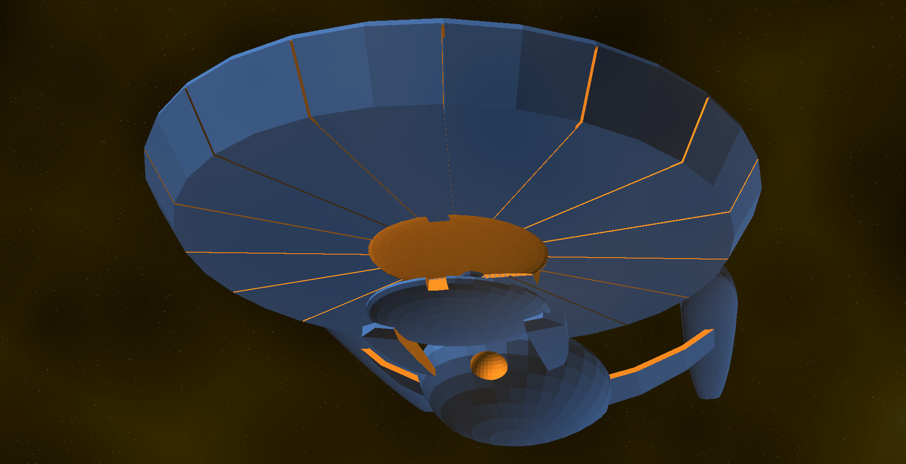
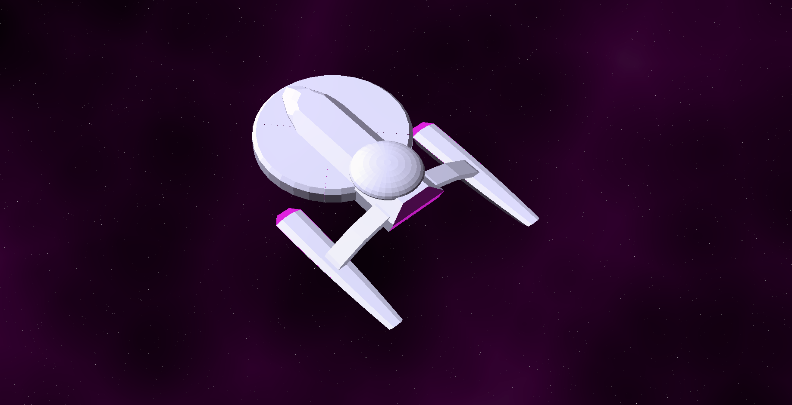
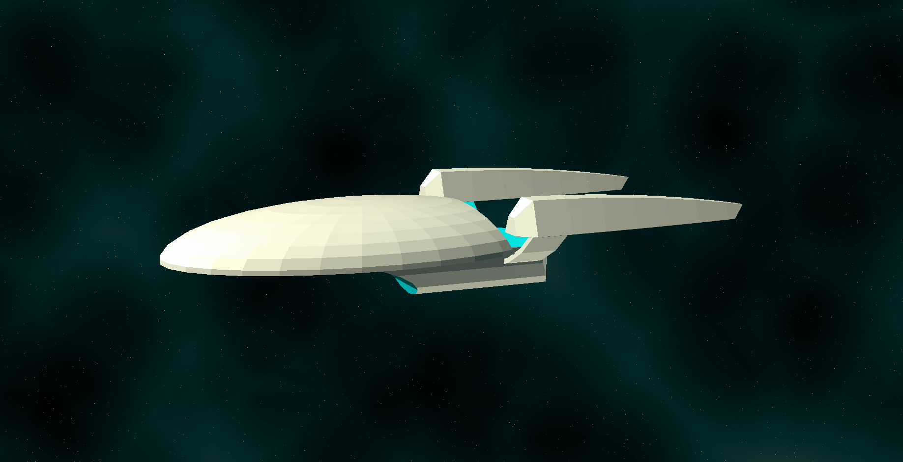
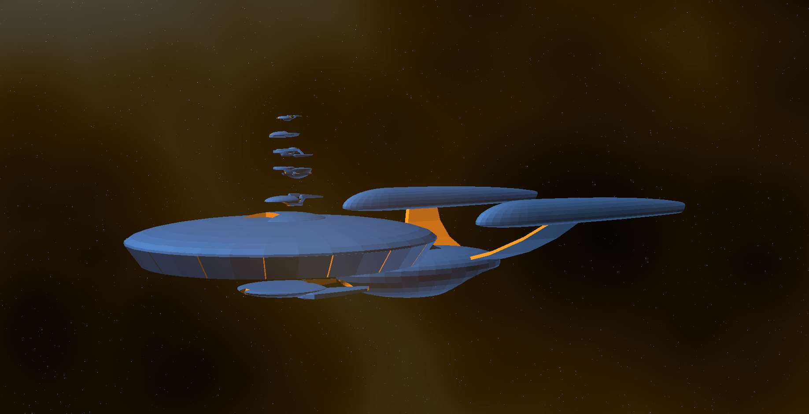
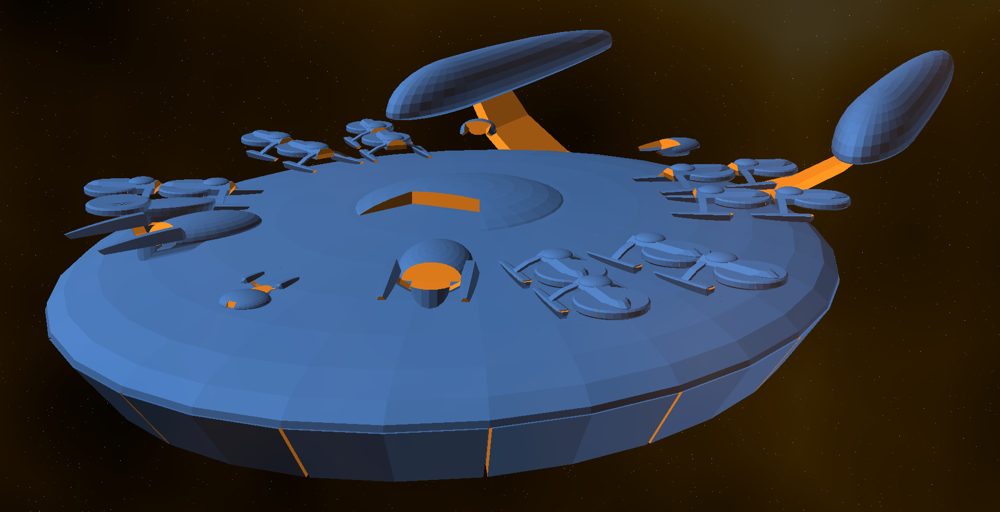

# Starship Designs

Star Trek type starships

## Aviary Class

[View 3d](https://github.com/prasannax1/openscad/blob/master/stl/mother.stl)

Aviary Class Deep Space Explorer/Heavy Cruiser/Carrier

### Stats

 * Length: 1154m
 * Width: 580m
 * Height: 239m
 * Decks: 56
   * Saucer Section: 28 decks
   * Engine Section: 28 decks
 * Auxillary Craft - Large:
   * 14 *Magpie Class* Light Science vessels
   * 12 *Vulture Class* Light Corvette/Patrol vessels
   * 2 *White Owl Class* Light Scout vessels
   * 1 *Dove Class* Diplomatic Yacht/Light Courier
   * 1 *Nightingale Class* Light Hospital Ship
   * 1 Escort Vessel
 * Warp speed:
   * Cruising: Warp 5
   * Maximum: Warp 7.3
   * Transwarp: ??

### Description

The *Aviary Class* is meant to act as both a deep space explorer, and as a mobile starbase to launch other exploration missions from. It is designed primarily for scientific missions, but like any ship designed after Wolf 359 and The Dominion War, it can also be used in military conflicts.

### Structure

The *Aviary* follows a pretty tradtional design, saucer, secondary hull and nacelles. The saucer is shaped to present a lower profile from the fore direction. It is fatter than you expect it, even on a ship this size, because most of the lower half of the saucer section consists of mobile hangars for small starship.

#### Saucer Section

The saucer section is almost as big as a *Galaxy Class* by itself. It is split into 4 main parts.

The top 5 decks of the saucer section consists of the upper bridge module. It consists of main bridge, main computer core, an auxillary sickbay. It also contains offices for the civilian government and administration for the civilian and starfleet residents of the *Aviary*. It also contains a cafeteria and dormitory for bridge and admin staff.

The next 9 decks of the saucer section contains the main inhabitable area of the *Aviary*. It is split up into 16 sections and a central core. The central core consists of main power coupling, turbolift routing and an auxillary computer core.

Each section contains an auxillary sickbay, a brig, and a replimat. They contain residences for the crew for all the ships in the hangar underneath, as well as residences for everyone who works in that sections. 8 of the sections contain secondary computer cores.

In addition, each section also contains areas which specialize. 

 * Section 0 is the diplomatic office. It also contains residence for diplomatic guests, residences for admiralty, a food court and a holo conference auditorium.

 * Sections 1, 3, 5, 6, 10, 11, 13, 14 and 15 are various science labs. The labs are reconfigurable per ship. These sections also contain 2 holodecks each, and a medium food court.

 * Section 2 is the main hospital. It also contains a quarantine area.

 * Section 4 is auxillary engineering. It has engineering labs and a light industrial replicator.

 * Section 7 is internal security. It contains weapons locker, and barracks for security personnel all over the ship, and main brig complex.

 * Section 8 is main engineering. Section 8 is mainly concerned with the running of the massive warp and transwarp engines that the *Aviary* sports.

 * Section 9 is external security. Section 8 is responsible for the defense and tactical operations of *Aviary* as well as providing security for away missions.

 * Section 12 is auxillary guest quarters for civilian passengers. It also contains a large food court and a large holo-complex.

The next 10 decks of the saucer section contains 16 hangars, each measuring 150m long and 100m wide on the borad side, and 40m tall. In addition to the hangars, it also contains the central core which is the main cargo store.

Like the section above it, each hangar contains ships specialized to the offices they handle.

 * Section 0 contains diplomatic yachts (*Dove Class*).

 * Section 1 and 15 contain the advanced light scout *White Owl Class* vessels.

 * Section 2 contains the *Nightingale Class* light hospital ship and medevac runabouts.

 * Sections 3, 5, 6, 10, 11, 13 and 14 contain two light *Magpie Class* science vessels each.

 * Section 4 hangar is actually a repair shop. It contains a standard Federation Warp Tug, and empty space to take apart and repair any ship of the *Aviaru* line-up.

 * Section 7 & Section 9 - internal security doesn't need ships, so both of these are used to store the 12 *Vulture Class* corvettes of the external security department.

 * Section 8 hangar is not a hangar at all - it contains the upper third of the massive warp core of the *Aviary* as well as main antimatter storage.

 * Section 12 is used to store security cleared and approved personal vehicles.

#### Captain's Yacht

In the space under the saucer traditionally used by Captain's yachts, the *Aviary* has a dedicated Escort vessel. Nicknamed the *Bat Class* (because it hangs upside down), is about as big as a *Defiant Class* and is as powerful as the *Defiant* would be if it was made today.

[View 3d](https://github.com/prasannax1/openscad/blob/master/stl/ms_saucer.stl)

### "*Bat Class*" stats

 * Length: 249m
 * Width: 155m
 * Height: 24m
 * Decks: 5
 * Auxillary Craft:
   * 2 Medium Shuttles
 * Warp Speed:
   * Cruising: Warp 7
   * Maximum: Warp 9.5

#### Engineering section

The engineering section contains 26 decks. The front half is used to house the warp and transwarp cores of the ship. The aft section is used as storage. There is no shuttlebay since the *Aviary* has hangars to spare.

## Magpie Class

[View 3d](https://github.com/prasannax1/openscad/blob/master/stl/science.stl)

Magpie Class Light Science Vessel

### Stats

 * Length: 81m
 * Width: 52m
 * Height: 17m
 * Decks: 2
 * Auxillary Craft: 1 Shuttlepod
 * Warp Speed:
   * Cruising: Warp 4
   * Maximum: Warp 8.5

### Description

The *Magpie Class* is the workhorse of the *Aviary* mini-fleet. Fast, agile and reasonable powerful, this ship is supposed to do the bulk of the exploring on any mission.

TODO

## Vulture Class

[View 3d](https://github.com/prasannax1/openscad/blob/master/stl/attack.stl)

Vulture Class Light Corvette/Patrol Vessel

### Stats

 * Length: 59m
 * Width: 31m
 * Height: 11m
 * Decks: 2.5 (2 + "attic" cargo deck)
 * Auxillary Craft: None
 * Warp Speed:
   * Cruising: Warp 7
   * Maximum: Warp 9.95

### Description

The *Vulture Class* is not just named after a bird of prey - for all practical purposes it is a Bird of Prey built to Star Fleet specifications.

The *Vulture Class* occupies a unique niche in starship where a runabout or a fighter craft just doesn't cut it, but a *Defiant Class* or equivalent isn't really readily available.  Typical deployment of these vessels is aboard a starbase, and typical missions involve escorting a larger vessel through troubled space. And coming back alone.

The *Vulture Class* might be small compared to most of the ships it will face, but it packs a mean punch in it's complement of phasers and torpedoes - and as if that were not enough, like the pack bird it's named after, the *Vulture Class* typically operates in teams of two or three. The multi vector attack patterns more than make up for any disadvantage the *Vulture Class* might have in battle.

Unlike the other ships of the *Aviary*, the *Vulture Class* wasn't designed specifically for it.  The *Vulture* has seen several notable battles, and was added as a tried and tested veteran to the *Aviary* line-up.

In *Aviary* missions, the *Vulture* will typically be deployed in case a *Magpie* runs into trouble it can't run out of. The *Vulture* is the cavalry, using it's top speed of warp 9.95 to arrive at the right moment to rescue.

## White Owl Class

[View 3d](https://github.com/prasannax1/openscad/blob/master/stl/scout.stl)

White Owl Class Light Scout

### Stats

 * Length: 113m
 * Width: 49m
 * Height: 21m
 * Decks: 5
   * Saucer Section: 3 decks
   * Engine Section: 2 decks
 * Auxillary Craft: 2 Shuttlepods
 * Warp Speed:
   * Cruising: Warp 7.5
   * Maximum: Warp 9.5
   
### Description

TODO

## Dove Class

[View 3d](https://github.com/prasannax1/openscad/blob/master/stl/diplomat.stl)

Dove Class Diplomatic Yacht/Light Courier

### Stats

 * Length: 46m
 * Width: 27m
 * Height: 10m
 * Decks: 2
   * Saucer Section: 1 deck
   * Engine Section: 1 deck
 * Auxillary Craft: None
 * Warp Speed:
   * Cruising: Warp 5
   * Maximum: Warp 7.5

### Description

With the underside of the *Aviary* taken up by a dedicated escort vessel, that still leaves the niche of a diplomatic vessel unfulfilled.

TODO

## Nightingale Class

[View 3d](https://github.com/prasannax1/openscad/blob/master/stl/hospital.stl)

Nightingale Class Light Hospital Ship

### Stats

 * Length: 80m
 * Width: 42m
 * Height: 22m
 * Decks: 6
   * Saucer section: 1 decks
   * Engineering section: 5 decks
 * Auxillary Craft: None
 * Warp Speed:
   * Cruising: Warp 7
   * Maximum: Warp 9
   
### Description

On the *Aviary* an entire sector is dedicated to sickbays, hospitals and clinics for the health and wellness of the crew within. But quite often, Starfleet is asked to extend a hand of help to other species who do not have the medical facilities to deal with it.

Enter the *Nightingale*. Named after Florence Nightingale, it is as big as a general hospital itself, it is equipped with some highly specialized medical equipment.

  * Medical transporters with highly sensitive biofilters
  * 4 separate bio-shielded quarantine areas
  * The latest of scanners
  * Gallons of biomemetic gel
  * 20 EMH and 45 EMAH (emergency medical assistant hologram)
  * 1 ECH in case the captain of the ship (nominally, the CMO of the *Aviary*)
    is incapacitated on mission.
  * Mobile holo-emitter kits to send EMH on missions where humanoids cannot go
    on.

The *Nightingale* has a cruising speed of warp 7, and can speed up to a warp 9 to get to a medical emergency. 

The *Vulture* bails out starfleet personnel when trouble is imminent; but when trouble has already stuck, it is the *Nightingale* which delivers mercy and salvation.

## Relative scale of ships

[View 3d](https://github.com/prasannax1/openscad/blob/master/stl/scale.stl)

[View 3d](https://github.com/prasannax1/openscad/blob/master/stl/combined.stl)
